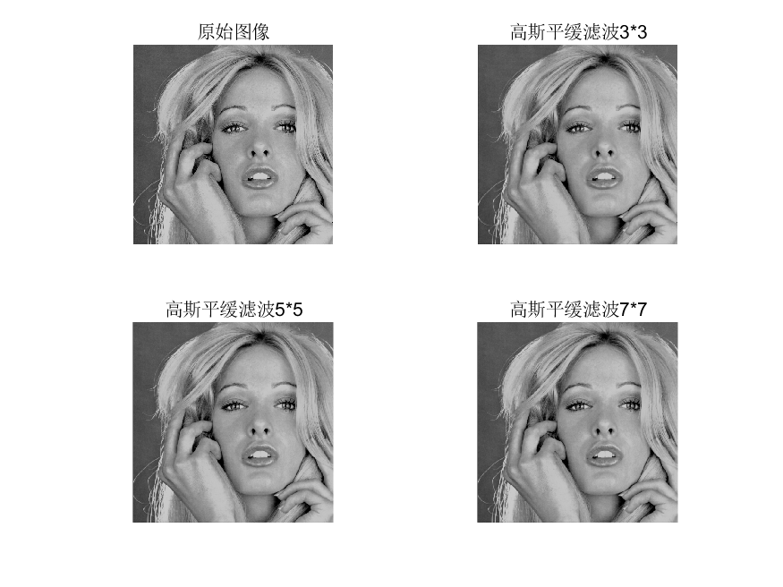
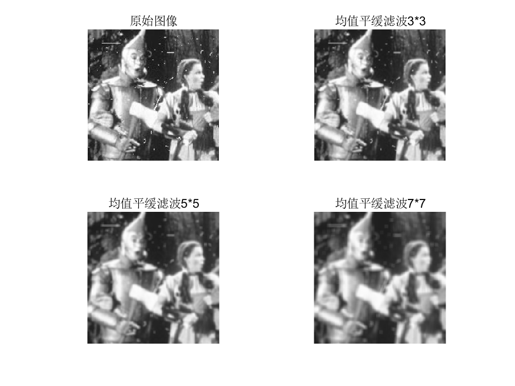
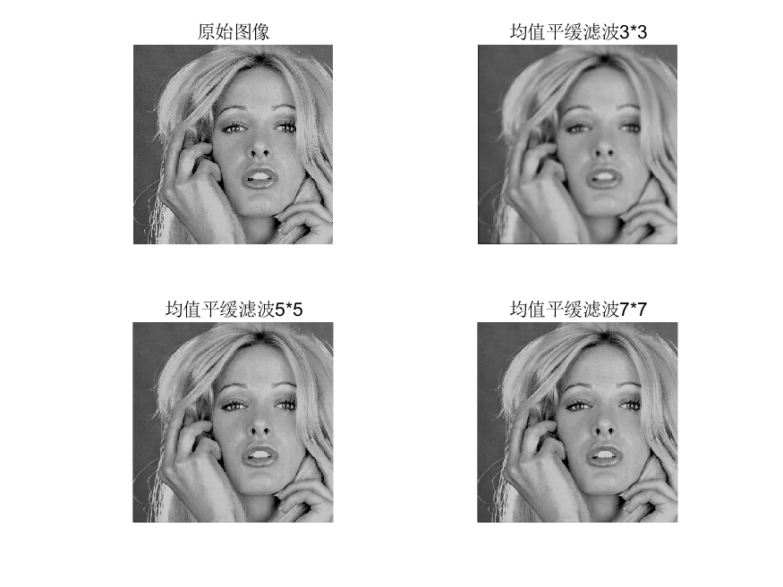
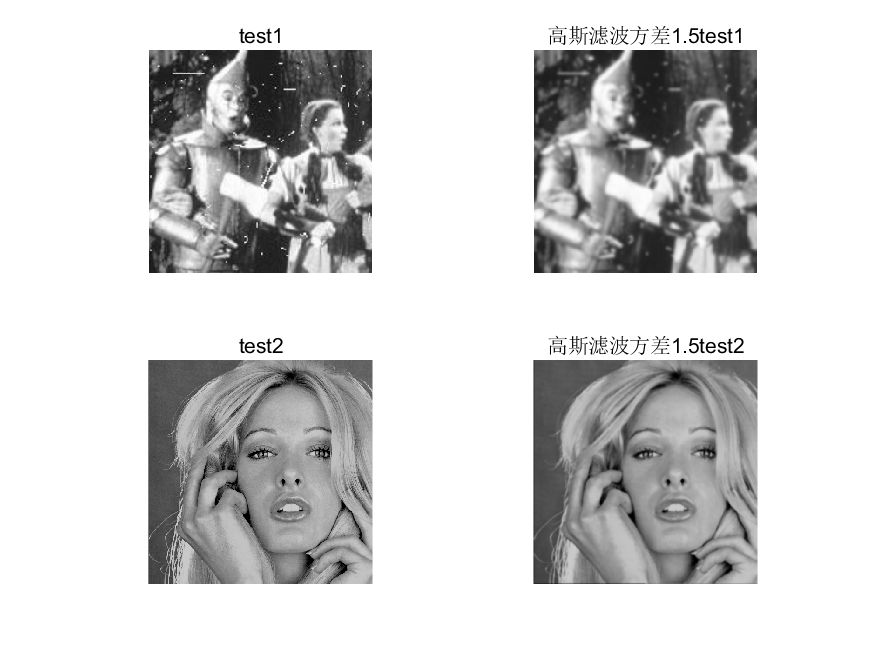
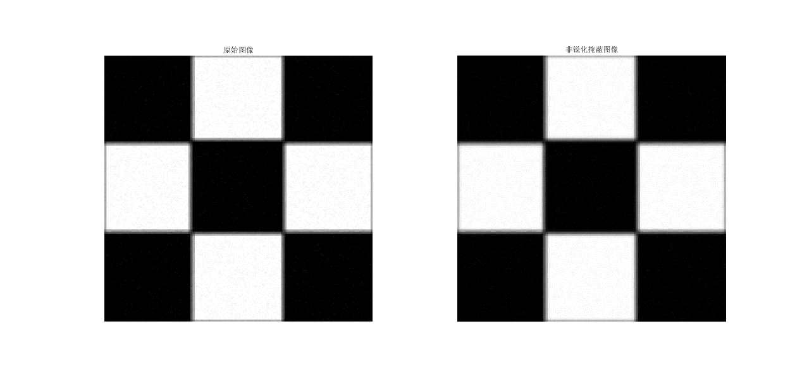
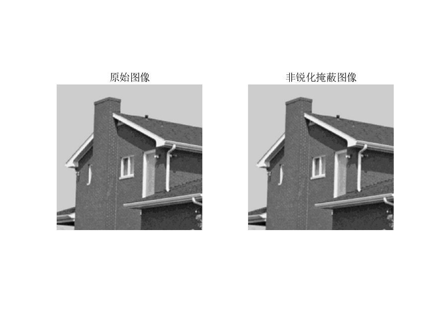
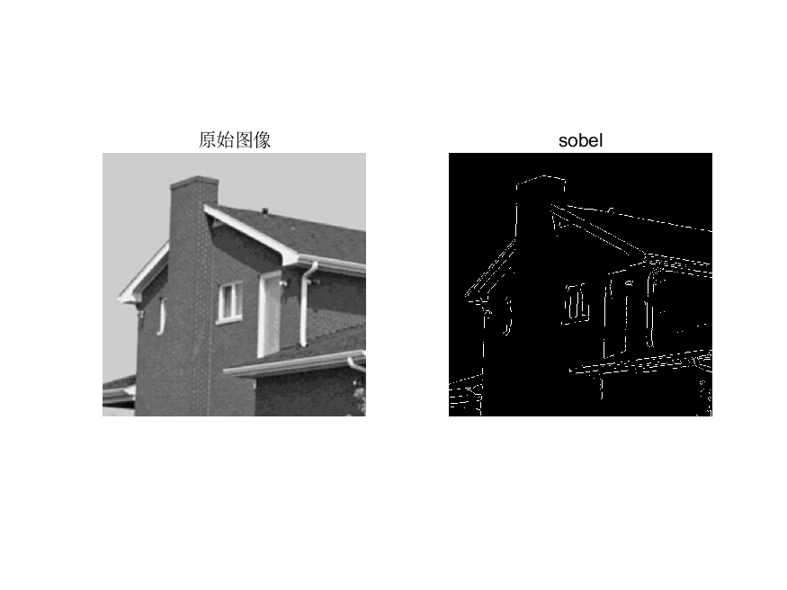
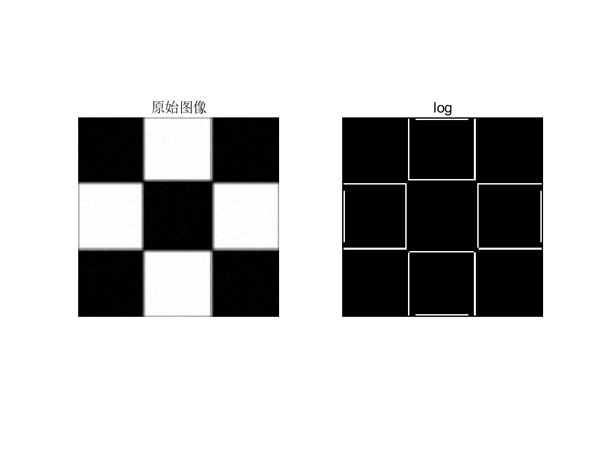

数字图像处理第四次作业

**摘要：**

**使用高斯滤波器高斯滤波器和中值滤波器去平滑测试图像test1和2，利用固定方差获取高斯滤波器，高通滤波器滤波测试图像test3,4：包括unsharp
masking, Sobel edge detector, and Laplace edge detection；Cannyalgorithm.**

**姓名：赵毅**

**班级：自动化64**

**学号：2160504108**

**提交日期：2019/3/16**

1.  空域低通滤波器：分别用高斯滤波器和中值滤波器去平滑测试图像test1和2，模板大小分别是3x3
    ， 5x5 ，7x7； 分析各自优缺点；

结果分析：消除噪声点上优于高斯滤波，但是可能造成图像信息量的丢失，使得图像变得模糊。滤波器越大对图片造成的影响也越大。

2.-利用固定方差 sigma=1.5产生高斯滤波器. 附件有产生高斯滤波器的方法；
分析各自优缺点；

使用方差为1.5的高斯滤波能够减少噪声使得图像更加平滑，但是也会使图像变得模糊

1.  利用高通滤波器滤波测试图像test3,4：包括unsharp masking, Sobel edge detector,
    and Laplace edge detection；Canny algorithm.分析各自优缺点；

>   unsharp
>   根据公式首先模糊原图像，从原图像中减去模糊图像将模糊图像加载到原图像上，权重系数为k=1时为非锐化掩蔽。结果如下

>   图像的边缘变得更加清晰。有利于进行便于提取

>   分别使用Sobel edge detector, and Laplace edge detection；Canny
>   algorithm进行边缘检测监测结果如下

>   经过对比使用Canny算子进行计算获取的信息更加的多得出的线条数目更加多，使用sobel得出的结果结果更加简单。利于图像分割。使用log提取出的边缘线条清晰但是会丢失部分信息。

>   附录：

>   代码

>   function unsharp(fir,k)

>   [hang,lie]=size(fir);

>   fir1= imgaussfilt(fir,'FilterSize',3);

>   g1=ones(hang,lie);

>   for i=1:hang

>   for j=1:lie

>   g1(i,j)=fir(i,j)-fir1(i,j);

>   end

>   end

>   output=ones(hang,lie);

>   for i=1:hang

>   for j=1:lie

>   output(i,j)=fir(i,j)+k\*g1(i,j);

>   end

>   end

>   subplot(1,2,1)

>   imshow(fir)

>   title('原始图像');

>   subplot(1,2,2)

>   imshow(fir1)

>   title('非锐化掩蔽图像');

>   fir= imread('test1.pgm');

>   fir1= imgaussfilt(fir,'FilterSize',3);

>   fir2= imgaussfilt(fir,'FilterSize',5);

>   fir3= imgaussfilt(fir,'FilterSize',7);

>   sec= imread('test2.tif');

>   sec1= imgaussfilt(sec,'FilterSize',3);

>   sec2= imgaussfilt(sec,'FilterSize',5);

>   sec3= imgaussfilt(sec,'FilterSize',7);

>   figure;

>   subplot(2,2,1)

>   imshow(fir)

>   title('原始图像');

>   subplot(2,2,2)

>   imshow(fir1)

>   title('高斯平缓滤波3\*3');

>   subplot(2,2,3)

>   imshow(fir2)

>   title('高斯平缓滤波5\*5');

>   subplot(2,2,4)

>   imshow(fir3)

>   title('高斯平缓滤波7\*7');

>   saveas(gcf, '1.png');

>   figure;

>   subplot(2,2,1)

>   imshow(sec)

>   title('原始图像');

>   subplot(2,2,2)

>   imshow(sec1)

>   title('高斯平缓滤波3\*3');

>   subplot(2,2,3)

>   imshow(sec2)

>   title('高斯平缓滤波5\*5');

>   subplot(2,2,4)

>   imshow(sec3)

>   title('高斯平缓滤波7\*7');

>   saveas(gcf, '2.png');

>   fir= imread('test1.pgm');

>   H=fspecial('average',3)

>   fir1 = imfilter(fir,H,'replicate');

>   H=fspecial('average',5)

>   fir2 = imfilter(fir,H,'replicate');

>   H=fspecial('average',7)

>   fir3 = imfilter(fir,H,'replicate');

>   sec= imread('test2.tif');

>   H=fspecial('average',3)

>   sec1 = imfilter(sec,H,'replicate');

>   H=fspecial('average',5)

>   sec1 = imfilter(sec,H,'replicate');

>   H=fspecial('average',7)

>   sec1 = imfilter(sec,H,'replicate');

>   subplot(2,2,1)

>   imshow(fir)

>   title('原始图像');

>   subplot(2,2,2)

>   imshow(fir1)

>   title('均值平缓滤波3\*3');

>   subplot(2,2,3)

>   imshow(fir2)

>   title('均值平缓滤波5\*5');

>   subplot(2,2,4)

>   imshow(fir3)

>   title('均值平缓滤波7\*7');

>   saveas(gcf, '3.png');

>   figure;

>   subplot(2,2,1)

>   imshow(sec)

>   title('原始图像');

>   subplot(2,2,2)

>   imshow(sec1)

>   title('均值平缓滤波3\*3');

>   subplot(2,2,3)

>   imshow(sec2)

>   title('均值平缓滤波5\*5');

>   subplot(2,2,4)

>   imshow(sec3)

>   title('均值平缓滤波7\*7');

>   saveas(gcf, '4.png');

>   fir= imread('test1.pgm');

>   fir1= imgaussfilt(fir,1.5);

>   sec= imread('test2.tif');

>   sec1= imgaussfilt(sec,1.5);

>   figure;

>   subplot(2,2,1)

>   imshow(fir)

>   title('test1');

>   subplot(2,2,2)

>   imshow(fir1)

>   title('高斯滤波方差1.5test1');

>   subplot(2,2,3)

>   imshow(sec)

>   title('test2');

>   subplot(2,2,4)

>   imshow(sec1)

>   title('高斯滤波方差1.5test2');

>   saveas(gcf, '5.png');

>   figure;

>   pi1= imread('test3_corrupt.pgm');unsharp(pi1,1);

>   saveas(gcf, '6.png');

>   figure;

>   pi2= imread('test4 copy.bmp');

>   unsharp(pi2,1);

>   saveas(gcf, '7.png');

>   out1=edge(pi1,'Sobel');

>   out2=edge(pi1,'log');

>   out3=edge(pi1,'Canny');

>   out4=edge(pi2,'Sobel');

>   out5=edge(pi2,'log');

>   out6=edge(pi2,'Canny');

>   figure;

>   subplot(1,2,1)

>   imshow(pi1)

>   title('原始图像');

>   subplot(1,2,2)

>   imshow(out1)

>   title('sobel');

>   saveas(gcf, '8.png');

>   figure;

>   subplot(1,2,1)

>   imshow(pi2)

>   title('原始图像');

>   subplot(1,2,2)

>   imshow(out4)

>   title('sobel');

>   saveas(gcf, '9.png');

>   figure;

>   subplot(1,2,1)

>   imshow(pi1)

>   title('原始图像');

>   subplot(1,2,2)

>   imshow(out2)

>   title('log');

>   saveas(gcf, '10.png');

>   figure;

>   subplot(1,2,1)

>   imshow(pi2)

>   title('原始图像');

>   subplot(1,2,2)

>   imshow(out5)

>   title('log');

>   saveas(gcf, '11.png');

>   figure;

>   subplot(1,2,1)

>   imshow(pi1)

>   title('原始图像');

>   subplot(1,2,2)

>   imshow(out3)

>   title('Canny');

>   saveas(gcf, '12.png');

>   figure;

>   subplot(1,2,1)

>   imshow(pi2)

>   title('原始图像');

>   subplot(1,2,2)

>   imshow(out6)

>   title('Canny');

>   saveas(gcf, '13.png');
